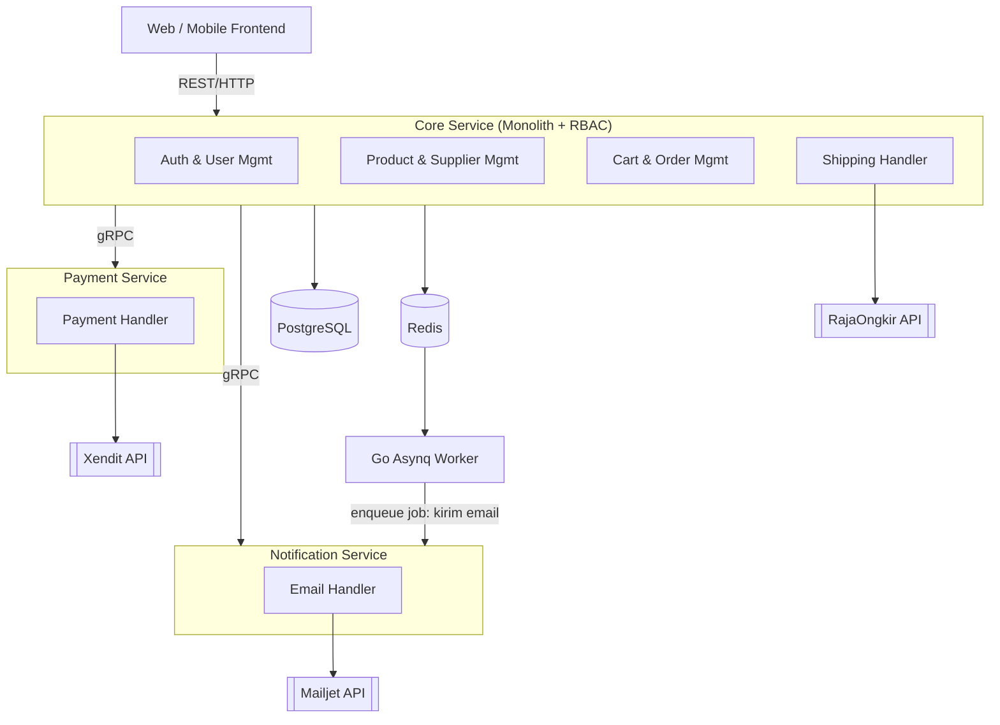
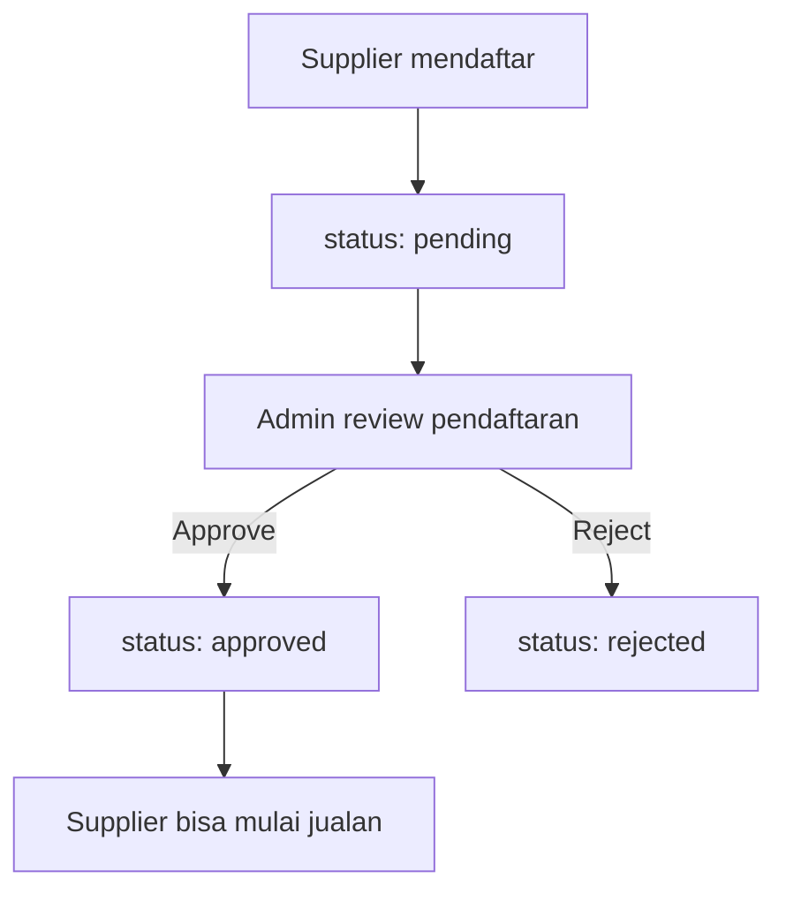
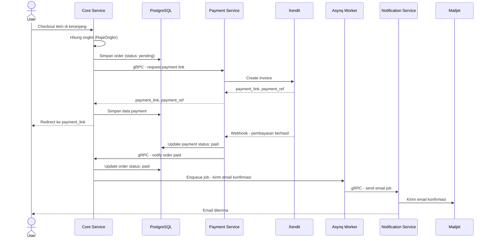
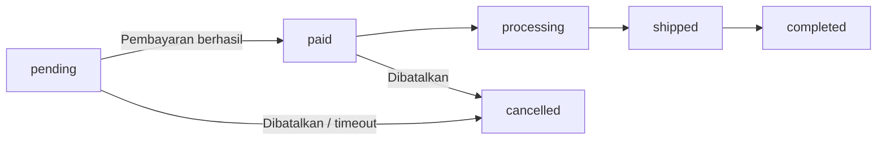
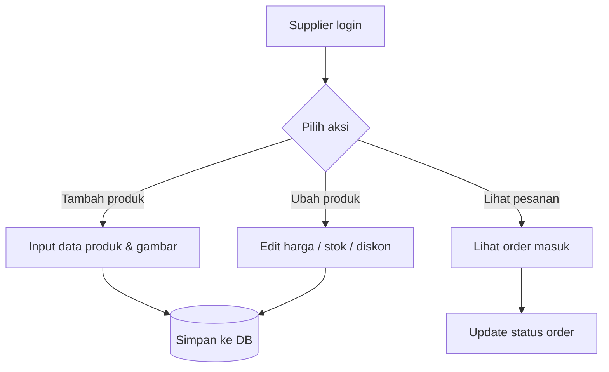
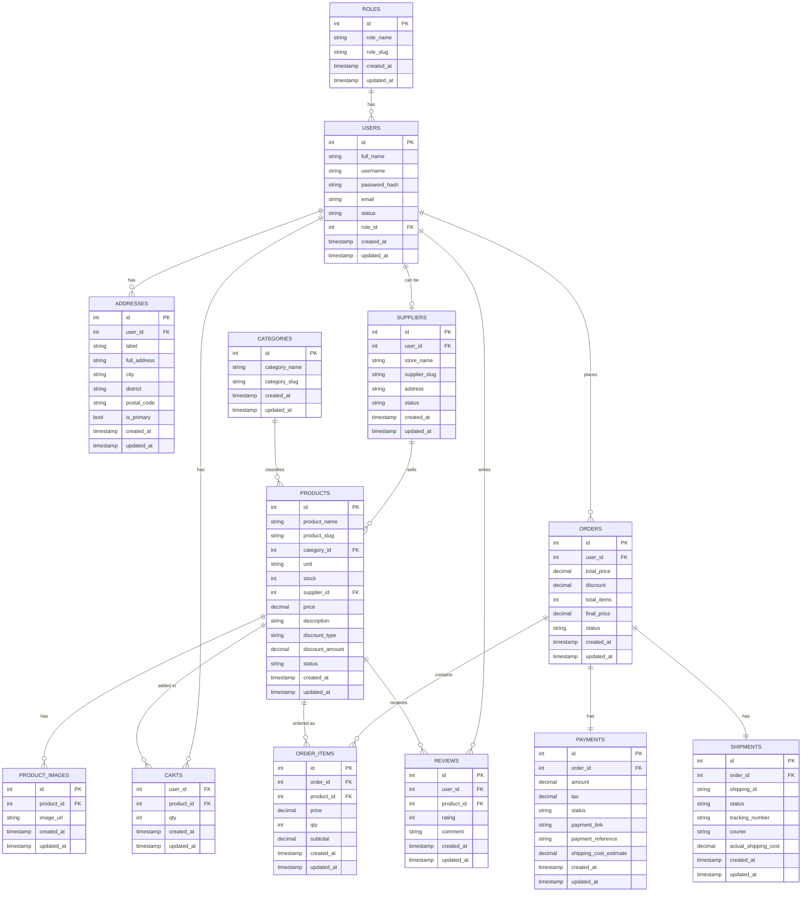

# Dokumentasi Final: Marketplace Bahan Bangunan

## Daftar Isi
1. [Ringkasan Proyek](#1-ringkasan-proyek)
2. [Tech Stack](#2-tech-stack)
3. [Arsitektur Sistem](#3-arsitektur-sistem)
4. [Peran & Fitur](#4-peran--fitur)
5. [Alur / Workflow Aplikasi](#5-alur--workflow-aplikasi)
6. [Struktur Database (ERD)](#6-struktur-database-erd)
7. [Detail Tabel Database](#7-detail-tabel-database)
8. [Hal yang Perlu Didiskusikan Tim](#8-hal-yang-perlu-didiskusikan-tim)

---

## 1. Ringkasan Proyek
- **Topik**: Industri bangunan (no. 9)
- **Model**: Semi-marketplace multi-supplier dengan 3 role: **Admin**, **Supplier**, **User**
- **Arsitektur**: Monolith (Core Service dengan RBAC) + service terpisah untuk Payment & Notification, komunikasi antar service pakai gRPC
- **Fitur user**: marketplace standar — cari produk, keranjang, checkout, bayar, lacak pengiriman, review

---

## 2. Tech Stack

| Layer | Tools |
|---|---|
| Backend framework | Golang + Echo |
| Config management | Go-Viper |
| Database | PostgreSQL |
| Cache | Redis |
| Background job / async worker | Go Asynq (broker: Redis) |
| Inter-service communication | gRPC |
| Payment | Xendit / simulasi |
| Shipping | RajaOngkir |
| Email notifikasi | Mailjet |

---

## 3. Arsitektur Sistem

**Core Service (Monolith + RBAC)** — 1 backend untuk 3 role (admin, supplier, user), dibedakan lewat role di tabel user:
- Auth & User Management
- Product & Supplier Management
- Cart & Order Management
- Shipping (integrasi RajaOngkir)

> **Aturan RBAC**: satu akun hanya boleh punya satu role (`role_id` langsung sebagai kolom di tabel `users`, bukan tabel relasi many-to-many). Login credentials (username, password, email) selalu tersimpan di satu tempat yaitu tabel `users`, sehingga tidak ada duplikasi identitas antara user, supplier, dan admin — mencegah konflik saat satu email/username dipakai untuk daftar ulang dengan role berbeda.

**Service Terpisah** (komunikasi ke Core via gRPC):
- **Payment Service** — integrasi Xendit / simulasi
- **Notification Service** — email via Mailjet

**Penggunaan Redis:**
- Cache listing/detail produk
- Session/token management
- Rate limiting
- Broker untuk background job via Go Asynq (mis. kirim email async, generate invoice, sync status ongkir)

---

## 4. Peran & Fitur

**Admin**
- Monitoring transaksi & aktivitas user/supplier
- Approve/reject pendaftaran supplier
- Pencatatan & laporan (penjualan, stok, dll)

**Supplier**
- Tambah, ubah, hapus produk
- Atur harga & diskon produk
- Atur stok barang
- Lihat & proses pesanan masuk

**User**
- Cari & lihat produk
- Keranjang & checkout
- Bayar via Xendit/simulasi
- Lacak status pengiriman
- Kasih review & rating produk

---

## 5. Alur / Workflow Aplikasi

### 5.1 Alur Registrasi & Approval Supplier

### 5.2 Alur Checkout & Pembayaran

### 5.3 Alur Status Order

### 5.4 Alur Supplier Kelola Produk

---

## 6. Struktur Database (ERD)

---

## 7. Detail Tabel Database

1. **users** — id, full_name, username, password_hash, email, status, role_id (FK ke roles) → satu akun cuma bisa punya satu role, jadi login credentials (username/password/email) selalu ada di satu tempat, gak digandakan ke tabel lain
2. **roles** — id, role_name, role_slug → role_slug jadi key stabil di middleware RBAC, gak ikut berubah kalau role_name diganti jadi label display
3. **suppliers** — id, user_id (FK, karena supplier juga login lewat `users`), store_name, supplier_slug, address, status
4. **addresses** — id, user_id, label, full_address, city, district, postal_code, is_primary → dibutuhkan buat hitung ongkir RajaOngkir
5. **categories** — id, category_name, category_slug → lebih baik daripada free text field, biar konsisten & gampang di-filter
6. **products** — id, product_name, product_slug, category_id (FK), unit, stock, supplier_id, price, description, discount_type, discount_amount, status
7. **product_images** — id, product_id, image_url → biar bisa multi-foto per produk
8. **carts** — user_id, product_id, qty
9. **orders** — id, user_id, total_price, discount, total_items, final_price, status
10. **order_items** — id, order_id, product_id, price, qty, subtotal → price disalin dari products.price saat order dibuat, biar histori order gak berubah kalau supplier ganti harga produk belakangan
11. **payments** — id, order_id, amount, tax, status, payment_link, payment_reference, shipping_cost_estimate
12. **shipments** — id, order_id, shipping_id, status, tracking_number, courier, actual_shipping_cost
13. **reviews** — id, user_id, product_id, rating, comment

> Kolom `*_slug` (roles, suppliers, categories, products) unique dan dipakai untuk URL/identitas publik yang SEO-friendly. `product_slug` khususnya digenerate app layer dengan suffix (mis. id produk atau random short code), karena `product_name` gak dijamin unique antar supplier.

> Fitur reward/voucher untuk sementara di-drop dari scope (masih brainstorming). Kalau nanti mau dilanjutkan, rencananya jadi microservice terpisah — jadi nggak masuk skema database ini.

---

## 8. Hal yang Perlu Didiskusikan Tim
- Job apa saja yang perlu dijadikan async task via Asynq (mis. kirim email, generate invoice, sync status ongkir)
- Skema gRPC contract antara Core Service ↔ Payment Service ↔ Notification Service
- Kapan fitur voucher/reward mulai dikerjakan sebagai microservice terpisah
